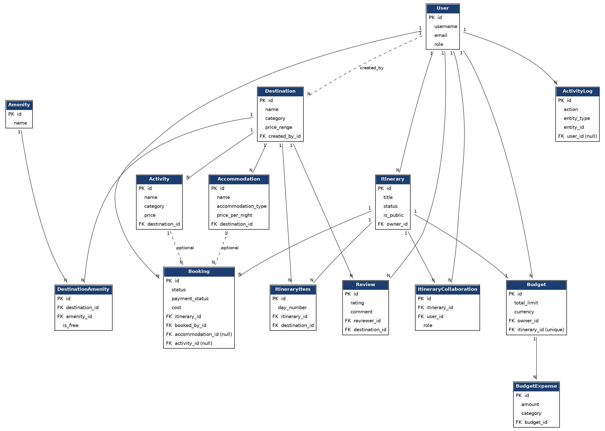

# Travel Itinerary Planning & Booking API

A Django REST Framework API for planning trips — browse destinations, build itineraries, book, and track budgets.

## Features

- **Accounts** — registration, JWT login/refresh, profile, password reset, admin management
- **Destinations** — browse/search/filter travel destinations, amenities, top-rated destinations
- **Itineraries** — multi-day trip plans with items, public/private visibility, status tracking, collaborators
- **Bookings** — book trips, accommodations, activities; track status/payment
- **Reviews** — rate and review destinations
- **Budgets** — set spending limits per itinerary, log expenses, get budget summaries

## Tech Stack

- Python 3 / Django 6.1
- Django REST Framework
- Simple JWT
- django-filter
- drf-spectacular (OpenAPI docs)
- SQLite (default)

## Environment Variables

Loaded from `.env` at the project root. Copy `.env.example` to `.env`:

| Variable | Description | Default |
|---|---|---|
| `SECRET_KEY` | Django secret key | required, no default |
| `DEBUG` | Enable debug mode | `False` |
| `ALLOWED_HOSTS` | Comma-separated list of allowed hosts | `localhost,127.0.0.1` |

## Setup

1. Clone and enter the folder:

   git clone <repo-url>
   cd travel-api-capstone

2. Create and activate a virtual environment:

   python -m venv venv
   source venv/bin/activate      # Windows: venv\Scripts\activate

3. Install dependencies:

   pip install -r requirements.txt

4. Copy the env template, set `SECRET_KEY`:

   cp .env.example .env

5. Migrate:

   python manage.py migrate

6. Create an admin user:

   python manage.py createsuperuser

7. Start the dev server:

   python manage.py runserver

## Database

SQLite by default (`db.sqlite3`, auto-created). No extra setup needed.

## Running Tests

   python manage.py test          # fast test settings
   pytest --cov=. --cov-report=term-missing

## Authentication Flow

The API uses JWT (via `djangorestframework-simplejwt`):

1. Register an account.
2. Log in to receive an `access` and `refresh` token.
3. Send it on every request: `Authorization: Bearer <access_token>`.
4. When it expires, `POST` the refresh token to `login/refresh/`.

## Example API Requests

Register a user:

    curl -X POST http://127.0.0.1:8000/api/v1/accounts/register/ \
      -H "Content-Type: application/json" \
      -d '{"username": "jane", "password": "StrongPass123"}'

Log in:

    curl -X POST http://127.0.0.1:8000/api/v1/accounts/login/ \
      -H "Content-Type: application/json" \
      -d '{"username": "jane", "password": "StrongPass123"}'

Make an authenticated request:

    curl http://127.0.0.1:8000/api/v1/itineraries/ \
      -H "Authorization: Bearer <access_token>"

## API Documentation

Docs are available once the server is running:

- Swagger UI: `/api/docs/`
- ReDoc: `/api/redoc/`
- Raw OpenAPI schema: `/api/schema/`

## API Overview

All endpoints below are prefixed with `/api/v1/`.

### Accounts (`/accounts/`)

| Endpoint | Description |
|---|---|
| `POST register/` | Create a new account |
| `POST login/` | Obtain JWT access/refresh tokens |
| `POST login/refresh/` | Refresh an access token |
| `GET/PUT/PATCH profile/` | View/update own profile |
| `POST password/change/` | Change your password |
| `POST password/reset/` | Request a password reset |
| `POST password/reset/confirm/` | Confirm a password reset |
| `GET users/` | List all users (admin) |
| `GET/PUT/PATCH/DELETE users/<id>/` | Manage a user (admin) |

### Destinations (`/destinations/`)

| Endpoint | Description |
|---|---|
| `GET/POST destinations/` | List or create destinations (admin-only create) |
| `GET/PUT/PATCH/DELETE destinations/<id>/` | Retrieve/update/delete destination |
| `GET destinations/top_rated/` | Top 5 destinations by average rating |
| `GET destinations/recommendations/` | Personalized picks |

### Itineraries (`/itineraries/`)

| Endpoint | Description |
|---|---|
| `GET/POST itineraries/` | List or create itineraries |
| `GET/PUT/PATCH/DELETE itineraries/<id>/` | Retrieve/update/delete itinerary |
| `GET itineraries/public/` | Browse public itineraries |
| `GET/PATCH itineraries/<id>/status/` | View/update an itinerary's status |
| `GET/POST itineraries/<id>/collaborators/` | Add/list itinerary collaborators |
| `GET/PATCH/DELETE itineraries/<id>/collaborators/<user_id>/` | Manage a collaborator (owner only) |
| `GET/POST itineraries/<itinerary_id>/items/` | List/add items on an itinerary |
| `GET itineraries/search/` | Trip search with ranking |
| `GET itineraries/<id>/export-pdf/` | Itinerary summary PDF |

### Bookings (`/bookings/`)

| Endpoint | Description |
|---|---|
| `GET/POST bookings/` | List or create bookings |
| `GET/PUT/PATCH/DELETE bookings/<id>/` | Retrieve/update/delete booking |
| `POST bookings/<id>/confirm/` | Confirm a pending booking |
| `POST bookings/<id>/cancel/` | Cancel a booking |
| `POST bookings/bulk-update/` | Bulk-update multiple bookings |
| `GET/POST bookings/accommodations/` | List/create accommodations |
| `GET/POST bookings/activities/` | List/create activities/tours |
| `GET bookings/logs/` | Activity/audit log |

### Reviews (`/reviews/`)

| Endpoint | Description |
|---|---|
| `GET/POST reviews/` | List or create reviews |
| `GET/PUT/PATCH/DELETE reviews/<id>/` | Retrieve/update/delete review |
| `GET reviews/destination/<destination_id>/` | Reviews for a specific destination |
| `GET reviews/my_reviews/` | Your own reviews |

### Budgets (`/budgets/`)

| Endpoint | Description |
|---|---|
| `GET/POST budgets/` | List or create budgets |
| `GET/PUT/PATCH/DELETE budgets/<id>/` | Retrieve/update/delete a budget |
| `GET budgets/read-only/` | Read-only budget browsing |
| `GET/POST budgets/<budget_id>/expenses/` | List/add budget expenses |
| `GET budgets/<id>/summary/` | Budget summary (spent, remaining, status) |

## Project Structure

    travel_api/       # settings, root URLs
    accounts/         # custom user model, auth, profile
    destinations/     # destinations, amenities
    itineraries/      # itineraries and itinerary items
    bookings/         # bookings
    reviews/          # reviews
    budgets/          # budgets and expenses

## Entity Relationship Diagram

